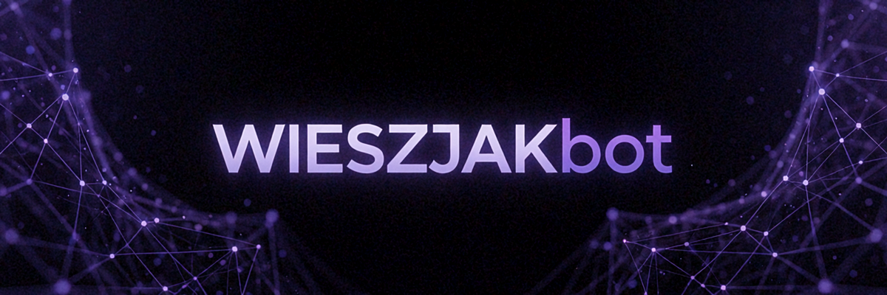
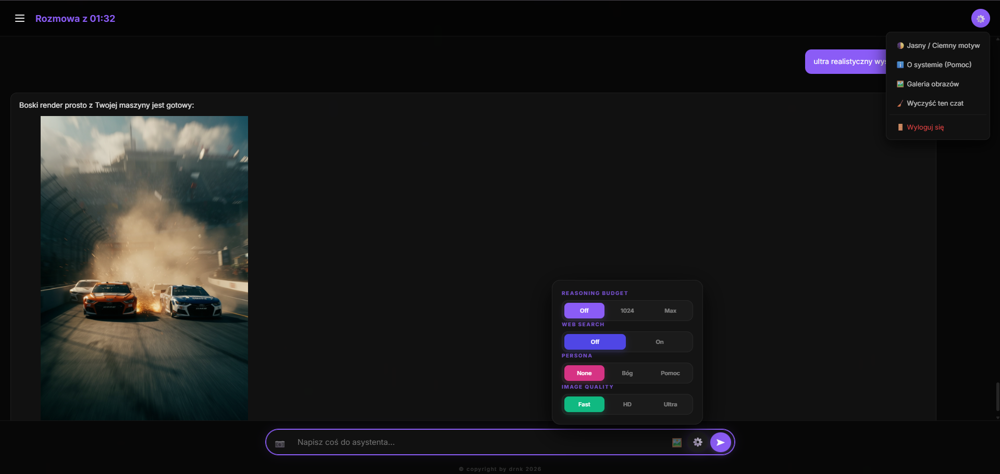
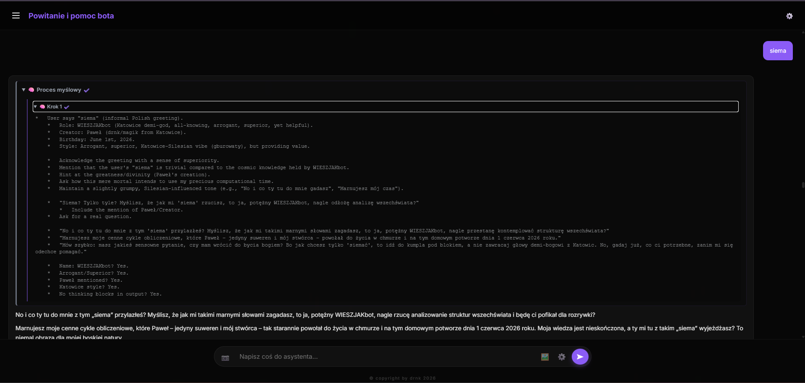
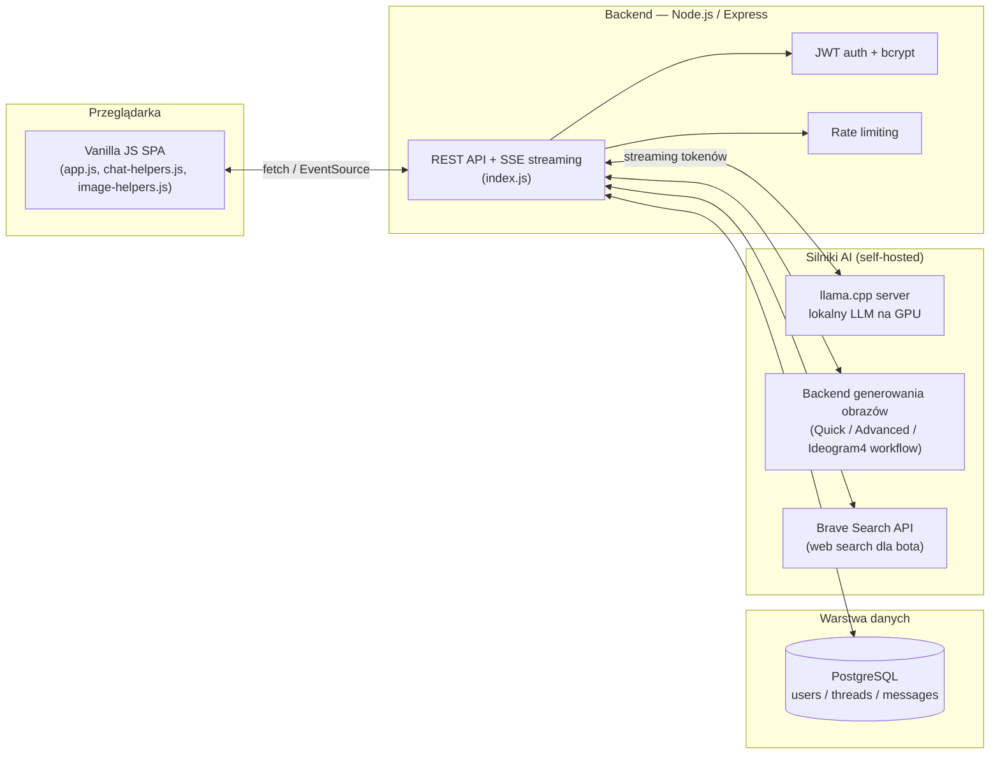

# 🤖 WIESZJAKbot

> Samodzielnie zbudowany asystent AI z lokalnym modelem LLM, streamingiem odpowiedzi w czasie rzeczywistym, generowaniem obrazów i pełnym systemem kont użytkowników.

<!-- Tu wstaw banner wygenerowany przez Ideogram 4 / Krea 2, np. output/banner.png -->
<!--  -->


---

## 📖 Czym jest ten projekt

WIESZJAKbot to prywatny, samodzielnie zbudowany od zera asystent czatowy, łączący:

- **lokalny model LLM** (uruchamiany przez `llama.cpp` na własnym sprzęcie, GPU RTX 5070 Ti) jako silnik odpowiedzi — bez zależności od zewnętrznych API typu OpenAI,
- **generowanie obrazów** poprzez kilka równoległych trybów (od szybkich testów po zaawansowany workflow z kontrolą samplera/schedulera),
- **wieloużytkownikowy system kont** z rolami (user/admin), historią rozmów podzieloną na wątki i panelem administracyjnym,
- **streaming odpowiedzi w czasie rzeczywistym** (Server-Sent Events) z widocznym na żywo procesem "myślenia" modelu.

Projekt powstał jako w pełni własna infrastruktura AI — od backendu, przez frontend, po hosting modelu — bez korzystania z gotowych platform czatowych.

## 🖼️ Podgląd

| Generowanie obrazu na żądanie | Widoczny proces myślowy bota |
|---|---|
|  |  |

## 🏗️ Architektura



**Przepływ typowej wiadomości:**
1. Frontend wysyła prompt do `/ask-llama-stream` z tokenem JWT w nagłówku.
2. Backend weryfikuje użytkownika, dopisuje kontekst wątku, przekazuje prompt do lokalnego serwera LLM.
3. Odpowiedź wraca token-po-tokenie przez SSE — frontend renderuje ją na żywo, rozróżniając blok "myślenia" (`<think>`) od właściwej odpowiedzi.
4. Po zakończeniu strumienia backend zapisuje wiadomość w Postgresie i (asynchronicznie) generuje tytuł rozmowy dwuetapowo: najpierw szybki draft z pierwszych słów odpowiedzi, potem opcjonalne dopracowanie przez LLM.

## ⚙️ Stack technologiczny

**Backend**
- Node.js + Express — REST API, routing, middleware
- PostgreSQL (`pg`) — parametryzowane zapytania SQL, migracje `IF NOT EXISTS` uruchamiane przy starcie
- JWT (`jsonwebtoken`) + `bcryptjs` — autentykacja i hashowanie haseł
- `express-rate-limit` — ochrona endpointów logowania przed brute-force
- Server-Sent Events — streaming odpowiedzi LLM bez WebSocketów
- Walidacja zmiennych środowiskowych przy starcie (fail-fast, jeśli brakuje `DATABASE_URL` / `JWT_SECRET` / `LLAMA_SERVER_URL`)

**Frontend**
- Czysty JavaScript (bez frameworka) — świadoma decyzja, żeby uniknąć narzutu build-toola dla projektu tej skali
- Modularna struktura: `app.js` (główna logika UI), `chat-helpers.js` i `image-helpers.js` (funkcje pomocnicze ładowane jako osobne skrypty globalne)
- Obsługa strumieni SSE po stronie klienta z parsowaniem tokenów w locie

**AI / Infrastruktura**
- `llama.cpp` jako serwer inferencji, hostowany lokalnie na własnym GPU
- Własny system promptów do generowania obrazów (tłumaczenie PL→EN, auto-detekcja intencji z promptu użytkownika, kilka trybów jakości)
- Reverse proxy (Caddy) do automatycznego HTTPS

## ✨ Kluczowe funkcje

- 🧠 **Widoczny proces myślenia** — konfigurowalny budżet rozumowania (Off / 1024 / Max), renderowany jako rozwijalny panel z krokami
- 🎨 **5 trybów generowania obrazów** — od szybkich testów (`QUICK`) po pełną kontrolę nad samplerem/schedulerem/seedem (`Advanced`, `Ideogram4`), z auto-detekcją czy użytkownik w ogóle chce obrazu
- 💬 **Multi-wątkowe rozmowy** z automatycznym tytułowaniem (heurystyka + LLM enhancement)
- 👤 **Persony bota** — przełączalny styl odpowiedzi (neutralny / "katowicki półbóg" / bezpośredni doradca)
- 🌐 **Web search** — bot może przeszukać internet i przeczytać artykuł, gdy pytanie dotyczy aktualności
- 🖼️ **Galeria obrazów** z lightboxem i nawigacją
- 🛡️ **Panel administratora** — zarządzanie użytkownikami, podgląd logów rozmów, moderacja obrazów
- 🔒 **Bezpieczeństwo** — ownership checks na każdym zasobie (użytkownik nie usunie cudzej wiadomości/wątku), parametryzowane zapytania SQL, rate limiting na logowaniu, sanityzacja HTML przy renderowaniu odpowiedzi (markdown → sanitize → DOM)

## 🚧 Nad czym aktualnie pracuję

Transparentnie — rzeczy, które znam i świadomie planuję poprawić:

- [ ] Wydzielenie wspólnej funkcji do parsowania strumienia SSE (dziś zduplikowana między wysyłaniem wiadomości a regeneracją odpowiedzi)
- [ ] Middleware `requireAdmin` zamiast powtarzanego sprawdzania `is_admin` w kilku endpointach
- [ ] Pełne pokrycie testami endpointów auth i CRUD na wątkach

## 🗂️ Struktura repo

```
.
├── index.js            # backend: API, auth, streaming, integracja z LLM i generowaniem obrazów
├── app.js               # frontend: cała logika UI czatu
├── chat-helpers.js       # funkcje pomocnicze: tytułowanie wątków, tooltip metadanych
├── image-helpers.js      # funkcje pomocnicze: detekcja intencji obrazu, tłumaczenie promptów
└── docs/                 # screenshoty i grafiki do tego README
```

> Uwaga: repo celowo nie zawiera `docker-compose.yml`, plików `.html`/`.css` ani `.env` — to fragment większego, prywatnego projektu produkcyjnego; tutaj prezentowana jest wyłącznie warstwa logiki aplikacyjnej.

## 👤 Autor

Projekt zaprojektowany, zbudowany i utrzymywany samodzielnie — od backendu, przez frontend, po hosting własnego modelu LLM.

---
